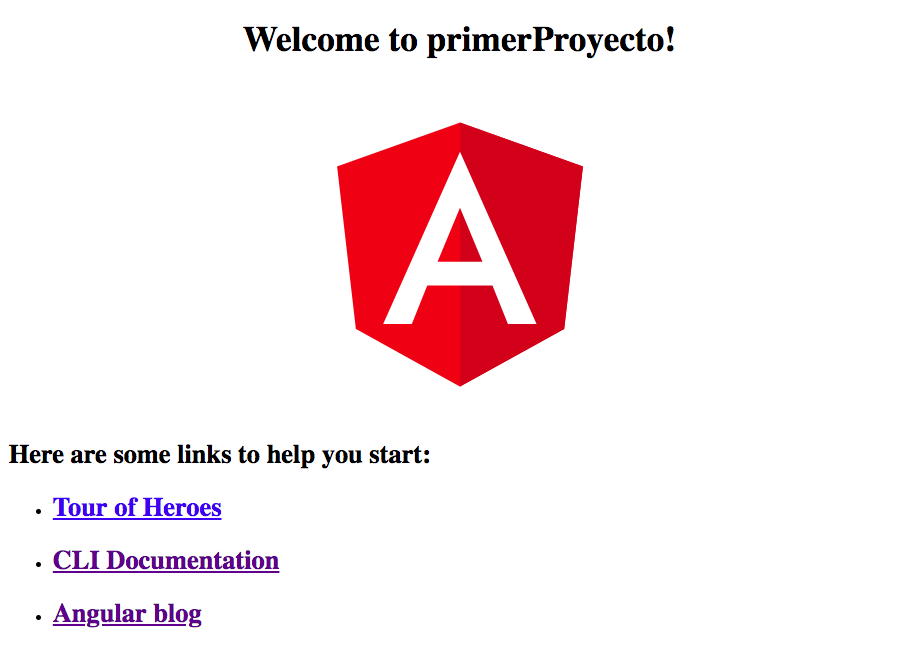

Greetings everyone, in today's post, I'll be starting a new series of publications about web development with Angular. Some of you who are not so familiar with the topic might be wondering, what is Angular?

**[Angular](https://angular.io/)** is an **MVC** (_Model-View-Controller_) framework developed by **Google** in late 2016 using **Typescript**, a superset of JavaScript. Its main purpose is to create **SPAs** (_Single Page Applications_). Other similar frameworks include **[React](https://reactjs.org/)** and **[Vue](https://vuejs.org/)**.

SPAs are **single-page applications**, meaning navigation between different sections of the site is done dynamically, instantly, and without refreshing the page in the browser at any point. These features have led to an increased use of SPAs in recent years.

## How to Get Started?

To start using Angular on our computers, we need to have at least **Node.js** version **8.x** or higher and **npm** version **5.x** or higher installed.

To check if you have these versions, open the terminal/console on Windows and type the following commands:

```
$ node -v
```

```
$ npm -v
```

If you have an older version, you can download the new version of [Node.js and npm](https://nodejs.org/en/download/).

Once we have these requirements met, we can proceed with installing the **Angular CLI** (_Command Line Interface_). This CLI will greatly assist us in creating different elements of our Angular application. To do this, run the command:

```
$ npm install -g angular/cli
```

Great, now we are ready to create our project.

## Creating Our First Project

To generate a new project, run the following command:

```
$ ng new firstProject
```

By using the "_ng new_" command followed by the name you want to give your project (in this case, "_firstProject_"), the Angular CLI will take care of **installing dependencies** and **generating the necessary files** for your new project.

Once the above command finishes executing, we will have our web application created.

## Launching the Project on a Web Server

At this point, we will have a directory named "firstProject" that was created in the previous step. Navigate into the directory:

```
$ cd firstProject
```

Once inside the directory, to launch the **server** and be able to see our application in the browser, run:

```
$ ng serve --open
```

The "_ng serve_" command deploys a server on **port 4200** by default, and the "_--open_" parameter will open a browser window where we can see our application running for the first time.



This image should appear in your browser if you've followed the previous steps correctly. It's the main component that Angular provides by default.

In the next post of this series, I will explain the **directory structure** and make modifications to the **main component**.

Best regards to all, and see you next time! 😃
