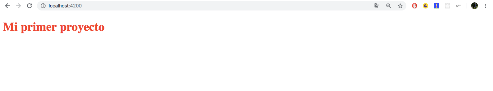

Continuing with the series on web application development in Angular. In today's post, we will analyze the **directory structure** and modify our **first component** in the project.

Starting from the project in the [**previous post**](https://jotagep.com/angular-first-steps/) ("_firstProject_"), generated using the **CLI**, it will have created all these directories and files in the project folder. We will explain each one so that we can understand what an Angular application is composed of.


- **e2e:** This folder, named "_end to end_", contains a set of files responsible for performing automated tests, as if a real user were interacting with our app. We'll dive deeper into this in upcoming posts.
- **node_modules:** This folder contains all the dependencies for our project.
- **.editorconfig:** Configuration for our code editor.
- **.gitignore:** Files or folders that Git should ignore when adding them to the repository.
- **angular.json:** A JSON file containing the Angular configuration. This file includes routes, names, versions, etc.
- **package.json:** Configuration for our application. This file contains the app's name, version, all the necessary dependencies for proper execution, etc.
- **tsconfig.json:** This file contains TypeScript configuration.
- **tslint.json:** It's the TypeScript _linter_, used for code maintainability and sustainability.

And you might ask, "Has a directory been skipped?" 🤔. Indeed, the **src directory** is missing. It's the **source** of our app, and it's the most important one, which is why I left it for last.


In this directory, you'll find the **app** folder, which contains the code for our application. We also see the **assets** folder, containing static files, and **environments**, which holds environment variables, among many other files that are part of our app.

If we access the **app** folder, we can find our **main component** (_app.component.ts_), along with its CSS style file and its HTML template with the same name. We can also find the **main module**, which wraps our component.

Now, let's focus on modifying our main component. To do this, we'll first open its **template** (_app.component.html_). We'll delete all the default content and add the following tag:

```html
<h1>My First Project</h1>
```

If we have the server running (remember that the command was "_ng serve -o_"), you will notice that the content of our app has changed.

Let's add some **style** to our component to give it a different color. To do this, we open the style file (`_app.component.css_`), and we write the following:

```css
h1 {
  color: red;
}
```

Once we've added the style, if we check the state of our application in the browser, it should look like this:



And _voilà!_, we've now modified our first component to display this message on the screen.

In the next chapter of the series, I'll delve deeper into how modules, components, services, directives, etc., relate in Angular.

I'll be looking forward to seeing you in the upcoming posts and on [Twitter](https://twitter.com/jotagep_dev). Best regards to all, and peace ✋.
