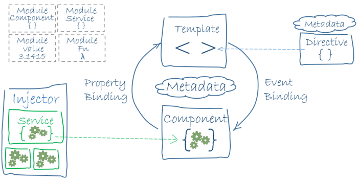
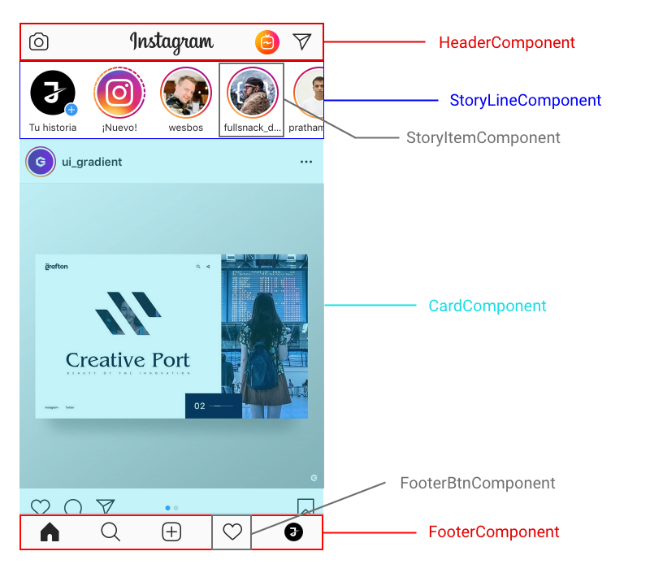
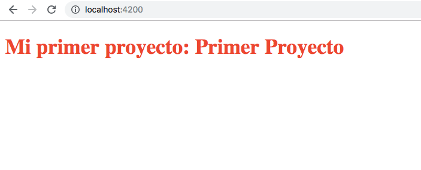

In today's post, we will continue with the introduction to Angular. As we already know, **Angular** is a framework dedicated to building web applications on **the client side**, which means that the behavior and rendering of our _"web app"_ are handled by the browser.

Let's take a look at a diagram illustrating the architecture of Angular and how different elements relate to each other.



To understand this diagram, let's classify the elements that make up Angular into three main blocks:

- **Modules**: NgModule
- **Components**: @Component, Template, Directives, Data-binding, etc.
- **Services and Dependency Injection**: @Injectable, Routing, etc.

In this post, we will focus on the first two blocks.

## Modules

Angular modules (_NgModules_) are quite different from JavaScript ES6 modules, although we'll also use the latter to manage library imports.

As we know, Angular applications are **modular**, meaning they consist of various **independent blocks**, each of which contains a part of the application or a set of its behaviors.

Every application should have at least one **NgModule** class, usually named _AppModule_, and its file is typically named _app.module.ts_.

```typescript
// ES6 imports
import { NgModule } from '@angular/core'
import { BrowserModule } from '@angular/platform-browser'
import { SomeProvider } from './providers/some_provider'

@NgModule({
  imports: [BrowserModule],
  providers: [SomeProvider],
  declarations: [AppComponent],
  exports: [AppComponent],
  bootstrap: [AppComponent],
})
export class AppModule {}
```

This would be an example of the **_root module_** of an Angular application. We import libraries using JavaScript and encapsulate them within the _@NgModule_ decorator. As you can see, the decorator has a set of _metadata_ or properties. Let's define the most important ones; you can find the rest in the [official Angular documentation](https://angular.io/api/core/NgModule).

- **declarations**: These are the components, directives, and pipes that belong to this module.
- **exports**: A set of "_declarations_" that need to be accessible for _component templates_ from other modules.
- **imports**: Modules exported by other classes that require the components from this module.
- **providers**: Services created by this module that can be used globally in the app.
- **bootstrap**: Defines the main view of the application. Only used by the _root module_.

## Components

A component controls an area of the screen called the _view_. A component is a JavaScript (ES6) class with the _@Component_ decorator.

Let's take a look at a real example of what a component is. For this, we'll take a screenshot from _Instagram_ and break it down into different components.



A component **includes properties and methods available** for its template, but it's important to be aware that not all logic should reside in this class. We should include everything related to the _controller_ of the _view_ in this class and abstract all other methods into services that will be injected later.

Let's take a look at the code of the _AppComponent_, which is our main component in our "_FirstProject_".

```typescript
import { Component, OnInit } from '@angular/core'

@Component({
  selector: 'app-root',
  templateUrl: './app.component.html',
  styleUrls: ['./app.component.css'],
})
export class AppComponent implements OnInit {
  title = 'First Project'

  constructor() {}

  ngOnInit() {}
}
```

First, let's talk about the metadata of the **@Component** decorator.

This example showcases some of the most important and commonly used attributes:

- **selector**: This is a CSS selector that instructs Angular to create an instance of this component when it encounters a _tag_ with that name in the HTML. In this case, when Angular encounters `<app-root></app-root>`, it will insert an instance of this component.
- **templateUrl**: This is the URL where the _template_ you want to bind to this component is located.
- **styleUrls**: An array of URLs to style files (CSS) that will be applied to our component.

You might also wonder why the class implements the _OnInit interface_. This is related to the lifecycle of Angular components. In this case, the **_ngOnInit_** method inherited from that interface will be executed when the component is created. In this post, we won't go into detail about the lifecycle; we'll cover it in depth in an upcoming post. Here's the [documentation](https://angular.io/guide/lifecycle-hooks) for the curious ones 🤔.

### Template

The _template_ is responsible for defining **the view of our component**. In the case of Angular, it's a **traditional but enhanced HTML** with a set of expressions and directives that improve its behavior and make our lives easier.

In a component's template, besides the regular HTML tags, you can find other distinct elements that Angular uses.

- **`*ngIf`**
- **`*ngFor`**
- **`(event)`**
- **`[property]`**
- **`<component></component>`**

In upcoming posts, we will analyze each of these in detail. For now, let's take a look at the template of our main component in "_firstProject_".

```html
<h1>My First Project: {{title}}</h1>
```

We execute the command `ng serve` in our terminal to see the result, and we would get the following:



We can see that it has inserted the value of the "_title_" variable from our component into the DOM. In Angular, this is called "**_interpolation_**," and it's very useful for creating web applications using this wonderful _framework_.

In the upcoming posts, we will discuss more about the syntax of the _template_ and learn while programming a web application for a to-do list. After all, the best way to learn programming is by programming, if you'll pardon the redundancy 😄.

See you here again soon, greetings everyone ✋.
