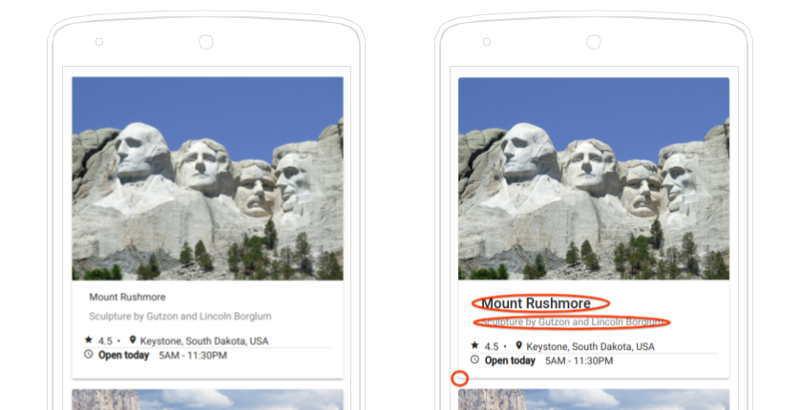

Just 5 days ago, the Angular team surprised us with a new _release_, **version 7.0.0**, which includes improvements in the framework's _core_ and mainly in "Angular Material."

### How to Update Your Application to Version 7

If your web application is developed in Angular version 6, the process is quite straightforward. You just need to execute this code snippet in the CLI.

```
ng update @angular/cli @angular/core
```

If you're on a different version, don't worry. The Angular team has developed a mini application to guide you on the path and make your life much easier. You can visit it at [update.angular.io](https://update.angular.io/), where you'll find detailed information on how to do it.

## Angular Material and the CDK

Following the significant update that **_Material Design_** underwent in 2018, the main goal of version 7's update is to **minimize visual differences** compared to the previous version.



They have also added to the CDK two modules that will allow us to use **"_Virtual Scrolling_"** and **"_Drag and drop_"** of elements in a simpler way.

### Virtual Scrolling

For those of you who aren't familiar with this term, _virtual scrolling_ involves **dynamically loading elements** of a list based on whether they are visible in the DOM or not. This allows us to save loading times for objects, especially in long lists, leading to an improved user experience.


An example of using "_virtual scrolling_" on a list would be as follows:

```html
<cdk-virtual-scroll-viewport itemSize="50" class="example-viewport">
  <div *cdkVirtualFor="let item of items" class="example-item">{{item}}</div>
</cdk-virtual-scroll-viewport>
```

If you want to learn more about this topic, I'll provide the [link to the Material page](https://material.angular.io/cdk/scrolling/overview).

### Drag & Drop

Now, the CDK includes **dragging and dropping an element**, and it automatically introduces a new method for reordering lists called "_moveItemInArray_" and another method for transferring items between different lists called "_transferArrayItem_".

```html
<!--Template-->
<div cdkDropList class="list" (cdkDropListDropped)="drop($event)">
  <div class="box" *ngFor="let movie of movies" cdkDrag>{{movie}}</div>
</div>
```

```ts
// Component
drop(event: CdkDragDrop<string[]>) {
  moveItemInArray(this.movies, event.previousIndex, event.currentIndex);
}
```

For more information about these modules, I've attached the [link to the documentation](https://material.angular.io/cdk/drag-drop/overview).

## Update of the Official Documentation

Perhaps one of the highlights of this new version. What I already thought was one of the best official Angular documentation has now been expanded to include the **CLI documentation** and reorganized the various sections to make everything more concise and make the developer's life easier.

[Official Angular Documentation](https://angular.io/docs) 👍

## Update of Dependencies

It's also worth noting that they have updated some **external library dependencies**.

- [TypeScript 3.1](https://www.typescriptlang.org/docs/handbook/release-notes/typescript-3-1.html)
- [RxJS 6.3](https://github.com/ReactiveX/rxjs/blob/master/CHANGELOG.md#630-2018-08-30)
- [Node 10](http://https://nodejs.org/en/blog/release/v10.0.0/), they also support version 8

These are the main changes we can see in the **new version 7** of Angular. I should also mention that they've addressed **performance issues** and **improved the insertion of Angular Elements**, but we won't delve into that topic.

That concludes today's post. I hope you enjoyed it, and now it's time for everyone to try out the new version of Angular.

Best regards, and I look forward to seeing you in future articles 😃.
