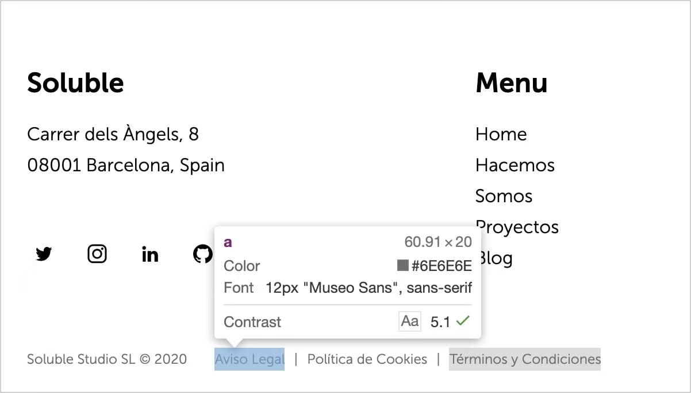
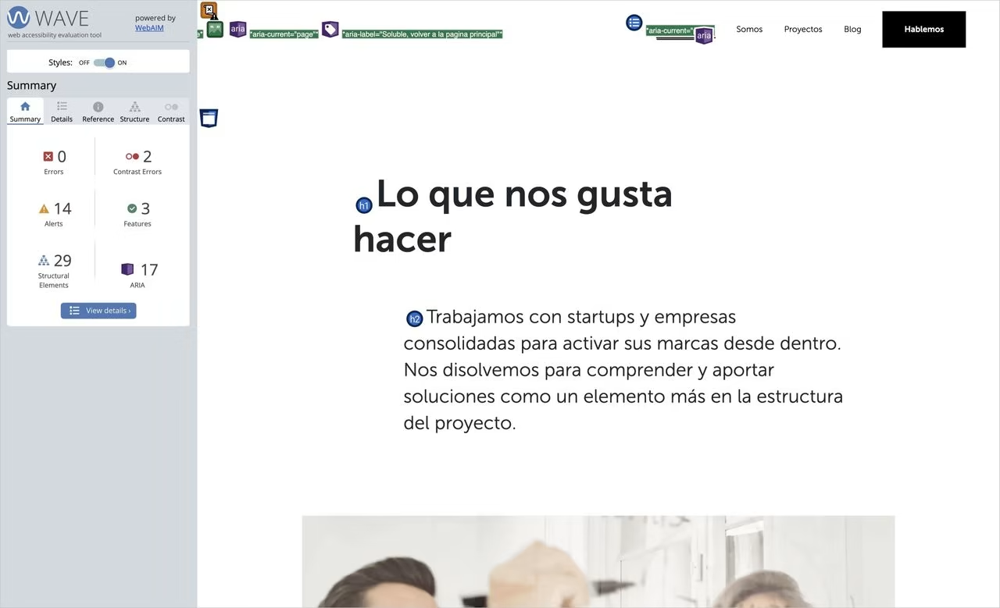
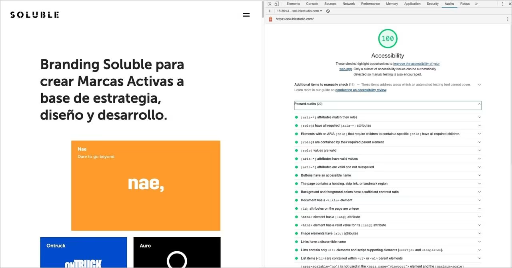

In this post, we will talk about the **great forgotten** aspect of web development: **accessibility**. According to the latest study conducted by **[WebAIM](https://webaim.org/)** (Web accessibility in mind) on more than one million websites, **97.8%** of the sites consulted present accessibility errors on their home pages. A really high figure where **Spain stands out in the top ten** countries with the highest error rate.

This leads us to ask the following question: **Do we really know what accessibility is?**

We say that a site is **accessible** when its content is available and its functionality can be handled by **anyone**. Following this definition, we understand **web accessibility** as the experience that the site offers to those users, outside the "typical," who have some type of disability or impediment for common navigation.

### The Minority Myth

One of the main factors why accessibility is a **pending subject** is the belief that it only affects a very small minority and is not worth allocating resources to.

When we refer to users who need accessibility help, we usually think of people who have serious visual or hearing problems, such as **blindness or deafness**. But these are only the **tip of the iceberg** of many other users who benefit from the advantages of an accessible site.

We can divide disabilities into **three types** according to their duration:

- **Situational**
- **Temporary**
- **Permanent**

So adding these three categories together, it is **more common than it seems** to find yourself in a disability situation. Whether temporary, such as a broken arm bone, or even a situational situation, such as being in a noisy workplace and not being able to clearly hear the sounds of the website you are browsing at that moment. In both cases, accessibility concepts would need to be applied to ensure correct navigation through our website.

### How to Make Your Website Accessible?

To achieve a more accessible website, you need to solve these **three main thematic areas**:

- **Focus**. It is important to create sites that can be navigated from the keyboard in addition to the mouse.
- **Semantics**. Our user interface has to be able to be interpreted by a variety of assistive technologies.
- **Styles**. We have to check that our different visual elements are usable by the majority of possible users.

Accessibility is a **transversal process** throughout the entire project. So we would start making our site more accessible from any of the phases of a branding project. We are not going to cover in this post how to approach accessibility from strategy, verbal or visual brand identity so as not to make it too long, but let's see how to do it from design and then from development.

### Accessibility in the Design Process

According to **WebAIM**, the most common error, with **85%**, is **low contrast** in the color of texts relative to their background. This problem especially affects users who have a visual disability such as **color blindness** or people with tired eyes.

We must ensure that our texts have a **contrast ratio greater than 4.5**, which is the minimum value required by the **[WCAG](https://www.w3.org/WAI/standards-guidelines/wcag/)** (Web Content Accessibility Guidelines). This way the visualization will be more accessible to a greater number of users.

On our website, we had to play with our range of grays to achieve a balance between **visual harmony and accessibility** to achieve the best possible accessible brand experience.



To check the contrast ratio between two colors in a simple way, **[WebAIM](https://webaim.org/)** provides us with a [tool](https://webaim.org/resources/contrastchecker/) that will help us know our ratio and the tests we pass. Also, and I really like it, we have the option of the **Google Chrome color inspector**, as we can see in the image, which shows us if the selected element would pass the WCAG contrast test.

The designer is also responsible for many other factors:

- Ensuring that content follows a **logical and ordered structure**
- Using **adequate font sizes**, always above **10px**
- **Differentiating links** from other elements, either with underlining or another style
- Maintaining **sufficient space between clickable content**, as they need to be spaced far enough apart so as not to pose a problem on mobile devices
- Styling, if necessary, a **focus indicator** on elements that require it
- Controlling the use of **uppercase**, which can be a problem in screen readers
- Carefully managing **animations and transitions** on the web that can be counterproductive to accessibility

Once we have this covered, we would be ready to start developing our accessible site.

### Accessibility in the Development Process

As we have defined previously, we have **three main areas** to solve in the development part if we want our site to be as accessible as possible.

### Focus

We refer to an **element that has focus** when it receives direct keyboard action. This element is usually shown with a colored border around it to show us that it is the element with active focus.

It is important to give an **alternative style** if you decide to change the border that the browser assigns you by default.

```css
// Error ❌
:focus {
 outline: none; // or 0
}

// Correct ✅: always provide an alternative
:focus {
 outline: 2px solid #eeeeee;
}
```

For our web to be accessible, we have to make sure that the user can navigate between the interactive elements of the site in a **logical and ordered** way. To do this, they can use **TAB** to select the next element, and **SHIFT + TAB** to navigate to the previous element. In this way, we achieve complete navigation through all the interactive elements of the page, in a simple and effective way.

To define the navigation order, we have two main factors: the **order in the DOM** and the use of **tabindex**.

### Order in the DOM

The default behavior of tab navigation is to change focus to the next interactive element in the DOM. For this reason, it is **crucial for accessibility** to maintain a logical order at all times so that the user does not lose the main thread of your page.

A good practice is to use a **"Skip to content" button** that is hidden and only shown when you navigate by keyboard or other assistive device.

This button allows the user to skip the navigation bar and focus directly on the main content of the page. We show you the following example of how we have applied it on our website.

```css
// CSS for our skip animation button
.skip-btn {
  display: block;
  position: fixed;
  top: 32px;
  left: 0;
  transform: translateX(-100%);
}

.skip-btn:focus {
  transform: translateX(0);
}
```

### Using tabindex

Some native elements like **buttons or links** already take focus through keyboard navigation by default. But if you want to put another non-interactive element in the natural order, you must use **tabindex** to make it accessible from the keyboard.

Adding **`tabindex="0"`** to any HTML element, we will ensure that it enters the natural TAB order. This way we can manage to put the focus using the keyboard on specific elements that we want the user to stop at.

On the contrary, **`tabindex="-1"`** removes the element from the natural tab order, and makes it inaccessible via the keyboard. With this property, you give the user the opportunity to focus on what you consider important.

There is a pattern called **"roving tabIndex"** of a component, which consists of playing with the tabindex value between consecutive elements of this component such as buttons and through javascript giving them focus using the keyboard arrows. Then we will achieve through the arrows to change the focus on the children that compose it.

On our website, we have a perfect example to illustrate what we discussed in the previous paragraph. We control the focus through JavaScript in such a way that the user has the freedom to move with the arrows or TAB, which covers all possible navigation options following a logical order.

Here we can see the HTML code of our component.

```html
<ul class="tabs">
  <li>
    <a
      data-index="1"
      href="https://solublestudio.com/hacemos/estrategia-de-marca/"
      target="_blank"
      >Estrategia</a
    >
  </li>
  <li>
    <a
      data-index="2"
      href="https://solublestudio.com/hacemos/identidad-de-marca/"
      target="_blank"
      >Identidad</a
    >
  </li>
  <li>
    <a
      data-index="3"
      href="https://solublestudio.com/hacemos/activacion-de-marca/"
      target="_blank"
      >Activacion</a
    >
  </li>
</ul>
```

We select all the elements that can be focused, in this case the **`a`**. Once we have an array with all the elements, we just need to capture the direction arrow event and handle the focus to the new element.

```js
const tabsList = document.querySelector('ul.tabs')
const links = tabsList.querySelectorAll('a')

const handleFocus = (e) => {
  let index = parseInt(document.activeElement.dataset.index)

  // Arrow key <
  if (e.keyCode === 37 && index > 1) {
    index--
  }

  // Arrow key >
  if (e.keyCode === 39 && index < links.length) {
    index++
  }

  links[index - 1].focus()
}

links.forEach((link) => {
  link.addEventListener('keydown', handleFocus)
})
```

You can inspect the functionality of this [example](https://jsfiddle.net/solublestudio/0tyoapLk/).

There is also the possibility of using **`tabIndex > 0`** values, which would place the element at the top of the natural navigation order. I recommend **not using** this practice as it is considered an **anti-pattern**.

### HTML Semantics

**There is no better and simpler way** to make a website accessible than using good HTML semantics. What the old saying said **"call things by their name"**, in the case of accessibility and HTML labeling fits like a glove.

Since the simple fact of using the **`button`** tag instead of a **`div`** when you want to add a clickable element, helps **screen readers** a lot when it comes to interpreting DOM elements.

In some cases and as an exceptional measure, we can use the **`role`** attribute to redefine the behavior of an element.

```html
<div role="button" aria-pressed="false">Button</div>
```

### ARIA

**Native HTML** provides substantial help to assistive technology, but does not cover all possible cases. This niche is where **ARIA specifications** emerge. These specifications are applied to certain DOM elements to add extra information that must be interpreted by the device.

It should be remembered that **ARIA does not change the behavior** of the DOM element. But it does allow us to modify the **accessibility tree** of any component on the page and therefore improve the user experience.

**ARIA** allows us to add accessible labels and descriptions to elements, in addition to being able to create relationships between them.

Since we are not going to delve into all the power that ARIA has, I want to show you how it works by explaining a real case and how we have solved it on our website.

```html
// Hamburger menu
<button aria-pressed="false" aria-expanded="false" aria-label="Menú">
  <span class="menu-icon">...</span>
</button>
```

This is the HTML of our menu to display the navigation bar on mobile devices. We can see that it has **three ARIA specifications**:

- **`aria-label`**: It is responsible for telling assistive technology a text as an accessible label. It is usually used when the element does not have text inside.
- **`aria-pressed`**: Reports whether the button has been pressed, widely used in cases like checkbox or toggles.
- **`aria-expanded`**: Tells us that a visual element can be shown, as is the case with this menu.

When we press the button, the values of **`aria-pressed`** and **`aria-expanded`** will become **`true`**. By changing the value, the **screen reader** will inform the user that the button has been activated and the menu has been opened.

### How to Know if My Site is Accessible?

There are several **available tools** that help us test our site. Thanks to them, we are more aware of the errors we are making to try to fix them.

First, we have **Chrome extensions** such as **[aXe](https://chrome.google.com/webstore/detail/axe-web-accessibility-tes/lhdoppojpmngadmnindnejefpokejbdd)** and **[WAVE](https://chrome.google.com/webstore/detail/wave-evaluation-tool/jbbplnpkjmmeebjpijfedlgcdilocofh)**. These two options offer us a series of tests for our website that are very useful for identifying problems such as color contrast ratios, HTML or ARIA labeling.



Another good way to find out if your site is navigable harmoniously for people with disabilities is to **put yourself in their shoes**. And what better way than using the same technology they use. Trying to navigate using only the **keyboard** or with **high contrast mode** will make us aware of whether it is an accessible site. We can also test our site with a **screen reader**, such as the browser extension **[ChromeVox](https://chrome.google.com/webstore/detail/chromevox-classic-extensi/kgejglhpjiefppelpmljglcjbhoiplfn?hl=es)** or the **[VoiceOver](https://www.apple.com/es/voiceover/info/guide/_1121.html)** application, the latter only available for Mac.

Finally, we are going to highlight the **[Google Lighthouse](https://developers.google.com/web/tools/lighthouse)** tool that, apart from measuring the performance of the site, also has an **accessibility test** that checks if your site meets the essential conditions to be called accessible.



### Is it Possible to Combine Visual Harmony and Accessibility?

Creating accessible websites makes you a **better developer and designer**. It forces you to use **good practices** that in turn increase the quality of your code. Although not everything is going to be "a bed of roses."

Certain aspects of design are **limited** when it comes to making your site accessible. Especially in the case of **animations**, **color ranges**, elements that appear due to scroll effects, etc.

There is still **much to improve**. We have to assess the limitations and maintain a **balance** that allows your site to be attractive to the user while being accessible.
