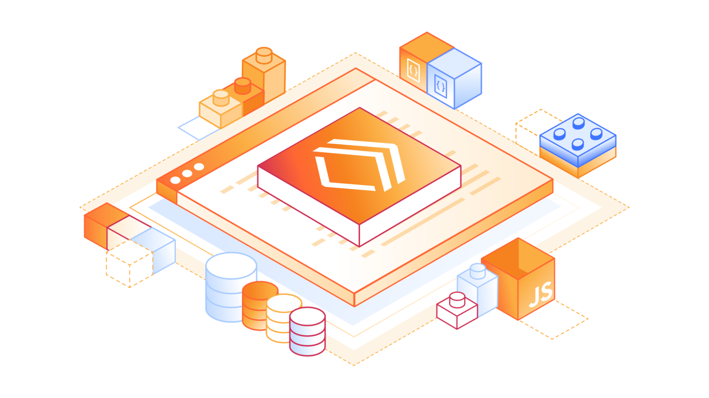

A few years ago, when we thought about deploying a "Full Stack" application, the shopping list was endless: a VPS server (or an EC2 instance), configuring Nginx, managing SSL certificates, setting up a database, worrying about scaling, backups... The cloud promised to make our lives easier, but sometimes it seemed like it only added more layers of complexity (and billing).

But then came **Edge Computing**, and with it, **Cloudflare**.

What started as a CDN and DDoS protection has quietly become one of the most powerful and versatile development platforms on the market. Today I want to explain why I believe the Cloudflare stack (Workers, D1, R2, etc.) is one of the best options you can choose for your next project in 2025.



### What is the "Cloudflare Stack"?

When we talk about developing on Cloudflare, we don't just mean putting your website behind their proxy. We mean building your application **entirely** on their global network.

The heart of it all is **Cloudflare Workers**. Unlike traditional lambda functions that spin up cold containers (cold starts), Workers are V8 isolates that start in milliseconds. They are incredibly fast and run in hundreds of locations around the world, as close as possible to your users.

But an app isn't just compute. This is where the rest of the family comes in:

- **Cloudflare D1**: The missing piece. A native SQL database (SQLite) at the edge. Finally, we can have relational databases without absurd latencies and with a simple API. **Ideal for:** User data, product catalogs, CMS.
- **R2**: Object storage (S3 compatible) but **without egress fees**. Yes, you read that right. You can serve terabytes of data without fear of the bill. **Ideal for:** User images, static assets, backups, PDFs.
- **Durable Objects**: For when you need state and strong consistency. Perfect for real-time applications like chats, games, or collaborative tools (think Figma or Google Docs).
- **KV**: Low-latency key-value storage for massive reads. **Ideal for:** Configuration, session tokens, redirects.

### Why choose this stack?

Beyond the technology, there are three fundamental reasons that have made me fall in love with it:

#### 1. Developer Experience (DX) on another level

If you've used **Wrangler** (the Cloudflare CLI), you know what I'm talking about. Local development is a delight. You can emulate the entire Cloudflare environment on your machine with a single command.

Moreover, frameworks like **Hono** have been born practically for this environment. Hono is an ultra-lightweight web framework (less than 14kb) that runs natively on Workers. Writing a REST API with Hono and D1 is as simple as this:

```typescript
import { Hono } from 'hono'
const app = new Hono()

app.get('/posts', async (c) => {
  const { results } = await c.env.DB.prepare('SELECT * FROM posts').all()
  return c.json(results)
})

export default app
```

No complex configurations, no Dockerfiles, no headaches.

And if we talk about databases, the combination of **D1 with Drizzle ORM** is simply a winner. Drizzle is lightweight, type-safe, and gets along wonderfully with the serverless ecosystem. Defining your schemas in TypeScript and deploying them to Cloudflare's global network is an experience that restores your faith in backend development.

#### 2. Global Performance by default

You don't have to configure regions. Your code is automatically deployed across Cloudflare's entire network. If a user accesses from Tokyo, your code runs in Tokyo. If they access from Madrid, it runs in Madrid. Latency is drastically reduced, and the user experience improves instantly.

#### 3. The Pricing (It's ridiculously good)

For personal projects, startups, and even medium-sized companies, Cloudflare's free tier is unbeatable.

- **Workers**: 100,000 requests per day for free.
- **R2**: 10 GB of storage for free and, I repeat, **zero egress costs**.
- **D1**: 5 million row reads per day for free.

You can scale to zero (pay €0 if no one uses your app) and scale to infinity without changing a single line of code.

And if you need more? The **Workers Paid** plan is ridiculously cheap. For **$5 a month** (yes, five dollars), you get:

- 10 million requests per month.
- 30s of CPU time per request (vs 10ms in the free tier).
- Access to more resources and higher limits.

It is probably the cheapest cloud that exists to scale a real project.

### Conclusion

Web development is evolving. We no longer need to be DevOps experts to deploy scalable and resilient applications. The Cloudflare stack allows us to focus on what really matters: **the code and the product**.

If you haven't tried it yet, I encourage you to install Wrangler and do your first "Hello World". I assure you that you won't look back.

### Where do I start?

If you want to jump into the deep end with the entire stack configured, I strongly recommend this boilerplate: **[Fullstack Next.js + Cloudflare](https://github.com/ifindev/fullstack-next-cloudflare)**.

It's a fantastic starting point that already integrates Next.js, Cloudflare Pages, D1, and authentication. Perfect for dissecting how all the pieces work together or for launching your MVP in record time.

See you at the edge! 🚀
