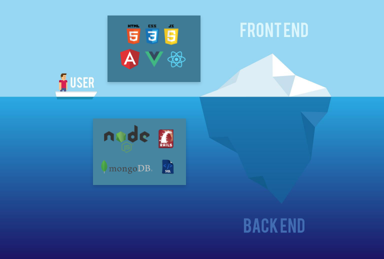
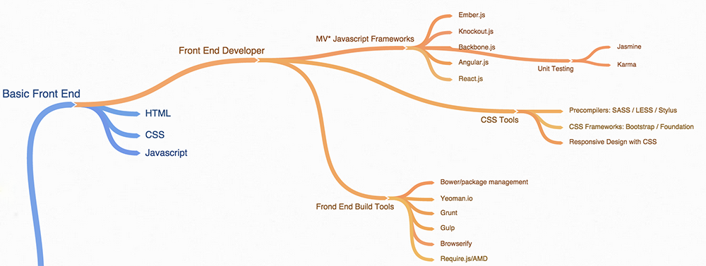
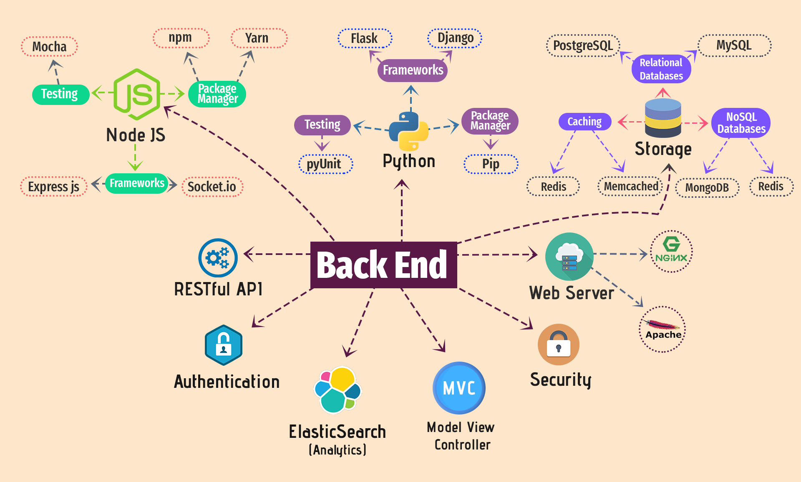

A la hora de iniciarse en el **desarrollo web**, debes elegir un camino a seguir, tienes que especializarte en un campo en concreto, ya que el “mundo” web engloba muchas y diversas tecnologías, y es imposible dominar todas.

Si observamos el mercado laboral y la organización de los equipos encargados de proyectos relacionados con la web, podemos distinguir tres tipos de “web developer”: **Front-End**, **Back-End** y **Full Stack.**

Antes de entrar a detallar cada uno de los tipos, cabe destacar que no son exclusivos entre sí, de hecho se complementan perfectamente y suelen trabajar en equipo dándose “feedback” unos a otros para conseguir aumentar la calidad del resultado final.

### _¿Que es un Front-End Developer?_

Este tipo de desarrollador trabaja del **lado del cliente**, es decir, es el encargado de programar toda la **parte que el usuario ve** de un sitio web o una aplicación web.

Los “_front-end developers_” se encargan del diseño, la usabilidad y accesibilidad del “_website_”, por este motivo para este perfil conviene tener nociones de diseño gráfico (colores, fuentes, tamaños, etc) para enriquecer la experiencia de usuario.

Para llevar a cabo sus tareas, necesita tener fuertes conocimientos en estas tecnologías:

- **HTML**: Es un lenguaje de “_hipermarcado_”, su función principal es dar la estructura al sitio web. Por poner un ejemplo real, serian los cimientos de la web.
- **CSS**: Hojas de estilo, se encarga de definir los estilos de la estructura HTML, añadir detalles, colores, tamaños, etc.
- **JavaScript**: Se encarga del comportamiento de la web, convertimos los elementos estático en interactivos.

Una vez domines estas tecnologías, puedes pasar a otras herramientas en auge y que no paran de crecer como son **Angular, React y Vue**.

Estos tres frameworks del lado del cliente, están revolucionando el mercado y parecen no tener techo. Siguiendo el patron de diseño **MVC** (Modelo-Vista-Controlador) y usando **_web Components_**, puedes construir una aplicación web de manera mas sencilla, ademas que podrás reutilizar estos componentes para otros proyectos futuros.

### _¿Que es un Back-End Developer?_

Un “_back-end developer_” es un programador del **lado del servidor.** Al contrario del “_front-end developer_” este se encarga de todo lo que esta **oculto al usuario**, pero que es imprescindible para el correcto funcionamiento de la aplicación web.

Un programador del “_back_” debe conocer en profundidad tanto un lenguaje de programación como saber interactuar correctamente con las **bases de datos**. Según la empresa y el proyecto en el que trabaje, usara un lenguaje de programación y una base de datos distinta.

Los lenguajes más usados en la actualidad del lado del servidor son:

- **Java**: Es uno de los lenguajes mas famosos y mas utilizados del mundo, sobre todo su versión enterprise (J2EE).
- **Python**: Uno de los lenguajes mas “_trendy_” del momento. Ha sufrido un crecimiento exponencial y es perfecto para el Big Data.
- **PHP**: Lenguaje de código abierto que puede ser incrustado en el HTML. A pesar de que sigue siendo de los mas utilizados, los lenguajes mas modernos van quitándole audiencia.
- **Node.js**: Permite construir programas escalables de código abierto, y su principal ventaja es que usa JavaScript. Por lo tanto, tanto el cliente como el servidor pueden ser programados en el mismo lenguaje.

En cuanto a la bases de datos, nos encontramos dos tipos principales: **relacionales** y **no relacionales**.

Las relacionales, como **MySQL**, dependen de un esquema relacional y son consultadas mediante “querys” en SQL. Por otro lado, las no relacionales, como **MongoDB**, en vez de guardar registros, almacena documentos en BSON, que es una representación binaria de JSON. Como principal ventaja de estas últimas, no necesitan seguir un esquema relacional por lo que le permite una escalabilidad de manera más sencilla.

### _¿Que es un Full Stack Developer?_

Un “_full stack developer_” es aquel que tiene **suficientes conocimientos tanto del “_front_” como del “_back_”** para ser capaz de llevar a cabo de principio a fin un proyecto web. Este perfil es mucho más completo, ya que sin tener por que ser un experto en ninguna de las dos facetas, se puede defender del lado del servidor y del lado del cliente.

Desde que ha surgido **node.js** en estos últimos años, el numero de _full stack developers_ se ha incrementado notoriamente, ya que al usar el mismo lenguaje de programación la curva de aprendizaje ha disminuido.

Llegados a este punto, ¿por que camino te vas a decantar? 🤔
