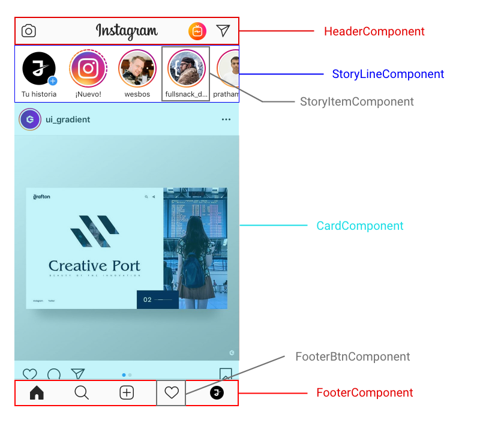

En el post de hoy continuaremos con la introducción a Angular. Como ya sabemos, **Angular** es un framework dedicado a construir aplicaciones web en **el cliente**, lo que quiere decir que es el navegador el encargado de llevar el comportamiento y renderizado de nuestra _"webapp"._

Vamos a observar un diagrama del funcionamiento de la arquitectura de Angular y como se relacionan los distintos elementos entre sí.


Para entender este esquema vamos a clasificar los elementes que componen Angular en tres bloques principales:

- **Módulos**: NgModule
- **Componentes**: @Component, Template, Directives, Data-binding, etc
- **Servicios e Inyección de dependencias**: @Injectable, Routing, etc

En este post nos vamos a centrar en los dos primeros bloques.

## Módulos

Los módulos de Angular (_NgModules_) son completamente diferentes a los módulos de JavaScript ES6, aunque también utilizaremos estos últimos para gestionar la importación de librerías.

Como sabemos las aplicaciones de Angular son **modulares**, es decir, se componen de varios **bloques independientes**, los cuales cada uno contiene una parte de la aplicación o una serie de comportamientos de esta.

Cada aplicación debe tener al menos una clase **NgModule**, normalmente llamada _AppModule_ y cuyo fichero es nombrado por defecto, _app.module.ts_.

```ts
// ES6 imports
import { NgModule } from '@angular/core'
import { BrowserModule } from '@angular/platform-browser'
import { SomeProvider } from './providers/some_provider'

@NgModule({
  imports: [BrowserModule],
  providers: [SomeProvider],
  declarations: [AppComponent],
  exports: [AppComponent],
  bootstrap: [AppComponent],
})
export class AppModule {}
```

Este sería un ejemplo del **_root module_**de una aplicación de Angular. Importamos las librerías utilizando JavaScript y las encapsulamos en el decorador _@NgModule._ Como podreís observar el decorador tiene una serie de *metadatos *o propiedades. Vamos a definir las más importantes, el resto las podeís ver en la [documentación](https://angular.io/api/core/NgModule) oficial de Angular.

- **declarations**: Son los componentes, directivas y pipes que pertenecen a este módulo.
- **exports**: Conjunto de "_declarations_" que deben ser accesibles para _components templates_ de otros módulos.
- **imports**: Módulos exportados por otras clases que necesitan los componentes de este módulo.
- **providers**: Servicios creados por este módulo y que podrán ser utilizados en el global de la app.
- **bootstrap**: Define la vista principal de la aplicación. Solo es utilizado por el _root module_.

## Componentes

Un componente controla un espacio de la pantalla, que se denomina _vista_. Un componente es un clase de JavaScript (ES6) con el decorador _@Component._

Vamos a ver un esquema de lo que es un componente en un ejemplo real. Para ello tomamos una captura de *instagram *y lo descompondremos en distintos componentes.



Un componente **incluye las propiedades y métodos disponibles** para su template, pero hay que ser consciente de que no toda la lógica debe contenerla esta clase, deberiamos incluir en esta clase todo lo referente al _controlador_ de la _vista_ y abstraer todos los demás métodos en servicios que seran inyectado posteriormente.

Vamos a ver el código del _AppComponent,_ es decir, nuestro componente principal de nuestro "_PrimerProyecto_".

```ts
import { Component, OnInit } from '@angular/core'

@Component({
  selector: 'app-root',
  templateUrl: './app.component.html',
  styleUrls: ['./app.component.css'],
})
export class AppComponent implements OnInit {
  title = 'Primer Proyecto'

  constructor() {}

  ngOnInit() {}
}
```

En primer lugar, vamos a hablar sobre la metadata del decorador **@Component**.

Este ejemplo muestra algunos de los atributos más importante y usados:

- **selector**: Se trata de un selector CSS que indica a Angular que debe crear una instancia de este componente cuando encuentre un _tag_ con ese nombre en el HTML. En este caso, cuando Angular encuentre `<app-root></app-root>` insertará una instancia de este componente.
- **templateUrl**: Es la url donde se encuentra el _template_ que quieres vincular a este componente.
- **styleUrls**: Un array con las urls a los archivos de estilo (CSS) que aplicaremos a nuestro componente.

También os preguntareis por qué la clase implementa la *interface OnInit. *Esto tiene que ver con el ciclo de vida de los componentes de Angular. En este caso, el método **_ngOnInit_**heredado de esa interfaz se ejecutaría cuando se crea el componente. En este post no entraremos en detalle sobre el ciclo de vida, lo trataremos en profundidad en próximo post. Os adjunto la [documentación](https://angular.io/guide/lifecycle-hooks) para los más curiosos 🤔.

### Template

El _template_ es el encargado de definir **la vista de nuestro componente**. En el caso de Angular se trata de un **HTML tradicional pero edulcorado** con una serie de expresiones y directivas que mejoran el comportamiento de este y nos hace la vida más fácil.

En el _template_ de un componente podemos encontrar, además de los tags normales de HTML, otros elementos distintos que utiliza Angular.

- **`*ngIf`**
- **`*ngFor`**
- **`(event)`**
- **`[property]`**
- **`<component></component>`**

En próximos post analizaremos cada uno detalladamente. Ahora vamos a observar el template de nuestro componente principal de "_primerProyecto_".

```html
<h1>Mi primer proyecto: {{title}}</h1>
```

Ejecutamos el comando `ng serve`, en nuestra terminal para ver el resultado, y obtendriamos lo siguiente:


Nos damos cuenta que ha insertado el valor de la variable "_title_" de nuestro componente en el DOM. Esto en Angular se llama "**_interpolation_**", y resulta muy útil para crear apliaciones web con este maravilloso _framework_.

En los proximas entradas comentaremos más sobre la sintaxis del _template_ y aprenderemos mientras programamos un aplicacion web de una lista de tareas. Ya que la mejor forma de aprender a programar es programando, valga la redundancia 😄.

Nos vemos proximamente por aqui, un saludo gente ✋.
