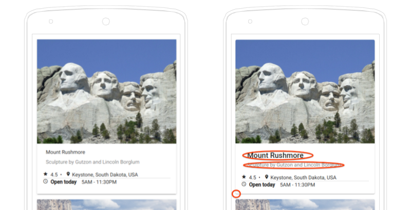

Hace a penas 5 días el equipo de Angular nos sorprendió con una nueva _realease_, la **versión 7.0.0**, que incluye mejoras en el _core_ del framework y en el "Angular Material" principalmente.

### Cómo actualizar tu aplicación a la version 7

Si tu aplicación web esta desarrollado en la versión 6 de Angular, lo tienes bastante sencillo, solo tienes que ejecutar este fragemento de código en el CLI.

```
ng update @angular/cli @angular/core
```

Si te encuentras en otra versión, no pasa nada. El equipo de Angular ha desarrollado una mini aplicación para guiarte en el camino y hacerte la vida mucho más fácil. La puedes visitar en [update.angular.io](https://update.angular.io/), allí encontraras toda la información detallada sobre como hacerlo.

## Angular Material y el CDK

Tras la gran actualización que tuvo **_Material Design_** en 2018, el principal objetivo de la actualización a la versión 7 es el de **minimizar las diferencias visuales** que había respecto a la anterior versión.



También han añadido al CDK, dos módulos que nos permitiran usar tanto **"_Virtual Scrolling" _**como** "_Drag and drop"_** de los elementos de una manera más sencilla.

### Virtual Scrolling

Para aquellos que no esteis familiarizados con esta expresión, _virtual scrolling_ se trata de la **carga dinámica de los elementos** de una lista en función si son visibles o no en el DOM. De esta forma nos permite ahorrar en tiempos de carga de objetos, sobre todo en listas largas, lo que provoca una mejor experiencia de usuario.


Un ejemplo del uso de "_virtual scrolling"_ sobre una lista seria el siguiente

```html
<cdk-virtual-scroll-viewport itemSize="50" class="example-viewport">
  <div *cdkVirtualFor="let item of items" class="example-item">{{item}}</div>
</cdk-virtual-scroll-viewport>
```

Si quereis saber más sobre este tema os dejo el [link a la página de Material](https://material.angular.io/cdk/scrolling/overview).

### Drag & Drop

Ahora el CDK incluye el **arrastra y soltar un elemento** e incluye de manera automática un nuevo método para reorganizar listas "_moveItemInArray_" y otro método para transferir items entre distintas listas "_transferArrayItem_".

```html
<!--Template-->
<div cdkDropList class="list" (cdkDropListDropped)="drop($event)">
  <div class="box" *ngFor="let movie of movies" cdkDrag>{{movie}}</div>
</div>
```

```ts
// Component
drop(event: CdkDragDrop<string[]>) {
  moveItemInArray(this.movies, event.previousIndex, event.currentIndex);
}
```

Para más información sobre este módulos os adjunto el [link a la documentación](https://material.angular.io/cdk/drag-drop/overview)

## Actualización de la documentación oficial

Quizas uno de los puntos que más me gusta de esta nueva versión. Y es que si ya me parecía que la documentación oficial de angular era de las mejores, ahora han incluido la **documentación del CLI** y han reorganizado los distintos apartados que tenian para dejar todo más conciso y hacer la vida más fácil al desarrollador.

[Documentación oficial de Angular](https://angular.io/docs) 👍

## Actualización de las dependencias

También cabe destacar que han actualizado algunas **dependencias de librerias externas**.

- [TypeScript 3.1](https://www.typescriptlang.org/docs/handbook/release-notes/typescript-3-1.html)
- [RxJS 6.3](https://github.com/ReactiveX/rxjs/blob/master/CHANGELOG.md#630-2018-08-30)
- [Node 10](http://https://nodejs.org/en/blog/release/v10.0.0/), tambien soportan la versión 8

Estos son los principales cambios que podemos ver en la** nueva version 7** de Angular. He de añadir que han corregido **problemas de rendimiento** y han **mejorado la inserción de Angular Elements**, pero no profundizaremos en este tema.

Hasta aqui el post de hoy, espero que os haya gustado y todos a probar la nueva versión de Angular.

Un saludo y os espero en próximos artículos 😃.
