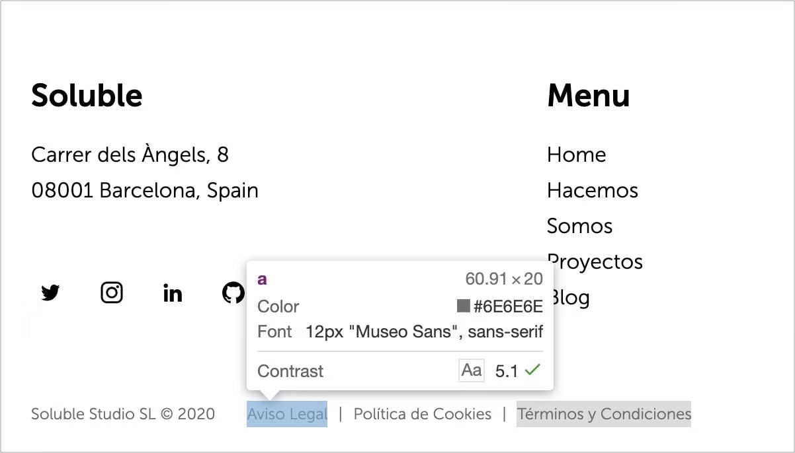
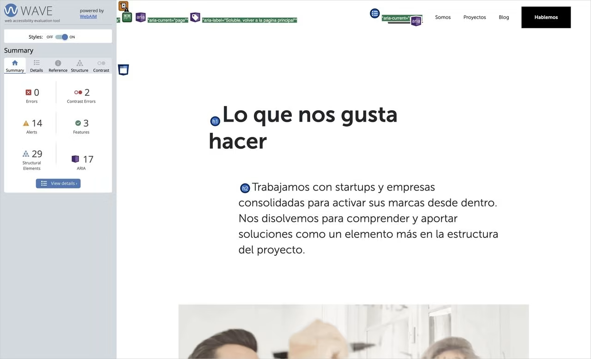
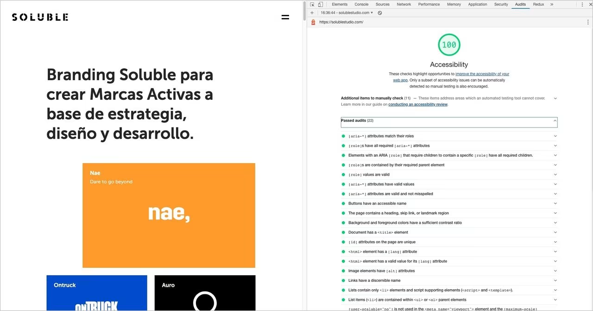

En este post hablaremos sobre el **gran olvidado** en el desarrollo web, la **accesibilidad**. Según el último estudio realizado por **[WebAIM](https://webaim.org/)** (Web accessibility in mind) sobre más de un millón de sitios web, el **97.8%** de los sitios consultados presentan errores de accesibilidad en sus home page. Una cifra realmente alta donde **España destaca en el top ten** de países con mayor tasa de errores.

Lo que nos lleva a preguntarnos la siguiente cuestión. **¿Sabemos qué es realmente la accesibilidad?**

Decimos que un sitio es **accesible** cuando su contenido está disponible y su funcionalidad puede ser manejada por **cualquier persona**. Siguiendo esta definición, entendemos por **accesibilidad web**, la experiencia que ofrece el sitio a aquellos usuarios, fuera de lo "típico", que presentan algún tipo de discapacidad o impedimento para una navegación común.

### El mito de la minoría
Uno de los principales factores por los que la accesibilidad es una **asignatura pendiente** es la creencia en que solo afecta a una minoría muy reducida y no vale la pena destinar recursos.

Cuando nos referimos a usuarios que necesitan ayuda de la accesibilidad, solemos pensar en personas que presentan problemas visuales o auditivos graves, como son la **ceguera o la sordera**. Pero estos solo son la **punta del iceberg** de otros muchos usuarios que se benefician de las ventajas de un sitio accesible.

Podemos dividir las discapacidades en **tres tipos** según su duración:

- **Circunstancial**
- **Temporal**
- **Permanente**

Por lo que sumando estas tres categorías, es **más común de lo que parece** encontrarse en una situación de discapacidad. Ya sea temporal, como podría ser una rotura de un hueso del brazo. O incluso una situación circunstancial, como sería el caso de encontrarse en un lugar de trabajo ruidoso y no pudieras apreciar con claridad los sonidos del sitio web por el que navegas en ese instante. En ambos casos se necesitaría aplicar conceptos de accesibilidad para asegurarnos de una correcta navegación por nuestra web.

### ¿Cómo hacer tu sitio web accesible?
Para conseguir un sitio web más accesible necesitas resolver estas **tres áreas temáticas principales**:

- **Foco**. Es importante crear sitios que puedan ser navegables desde teclado además del ratón.
- **Semántica**. Nuestra interfaz de usuario tiene que ser capaz de ser interpretada por una variedad de tecnologías asistenciales.
- **Estilos**. Tenemos que comprobar que nuestros distintos elementos visuales son utilizables por la mayoría de usuarios posibles.

La accesibilidad es un **proceso transversal** a todo el proyecto. Por lo que empezaríamos haciendo nuestro sitio más accesible desde cualquiera de las fases de un proyecto de branding. No vamos a tratar en este post cómo enfocar la accesibilidad desde la estrategia, la identidad verbal o visual de marca para no alargarnos mucho, pero veamos cómo hacerlo desde el diseño y luego desde el desarrollo.

### Accesibilidad en el proceso de diseño
Según **WebAIM**, el error más común, con un **85%**, es el **bajo contraste** en el color de los textos respecto a su background. Este problema afecta sobre todo a los usuarios que presentan una discapacidad visual como **daltonismo** o personas con la vista cansada.

Debemos asegurarnos que nuestros textos presentan un **ratio de contraste mayor a 4.5**, que es el valor mínimo exigido por el **[WCAG](https://www.w3.org/WAI/standards-guidelines/wcag/)** (Guía sobre el contenido accesible web). De esta manera la visualización será más accesible para mayor cantidad de usuarios.

En nuestra página web tuvimos que jugar con nuestra gama de grises para conseguir un equilibrio entre **armonía visual y accesibilidad** para conseguir la mejor experiencia de marca accesible posible.



Para comprobar el ratio de contraste entre dos colores de una manera sencilla **[WebAIM](https://webaim.org/)** nos proporciona una [herramienta](https://webaim.org/resources/contrastchecker/) que nos ayudará a saber nuestro ratio y los test que superamos. También, y a mi me gusta mucho, tenemos la opción del **inspector de colores de Google Chrome**, como podemos ver en la imagen, que nos muestra si el elemento seleccionado superaría el test de contraste del WCAG.

El diseñador también es responsable de muchos otros factores:

- Asegurarse de que el contenido sigue una **estructura lógica y ordenada**
- Usar **tamaños de fuente adecuados**, siempre por encima de **10px**
- **Diferenciar los links** del resto de elementos, ya sea con subrayado u otro estilo
- Mantener un **espacio suficiente entre contenidos clickables**, ya que necesitan estar distanciados lo suficiente para no suponer un problema en dispositivos móviles
- Estilar, si es necesario, un **indicador de foco** sobre los elementos que lo requieran
- Controlar el uso de **mayúsculas**, que pueden ser un problema en los screen readers
- Gestionar con cuidado las **animaciones y transiciones** de la web que pueden resultar contraproducentes para la accesibilidad

Una vez tenemos esto cubierto ya estaríamos listos para empezar con el desarrollo de nuestro sitio accesible.

### Accesibilidad en el proceso de desarrollo
Como hemos definido anteriormente, tenemos **tres áreas principales** por resolver en la parte de desarrollo si queremos que nuestro sitio sea los más accesible posible.

### Foco
Nos referimos a un **elemento que tiene el foco** cuando recibe la acción directa del teclado. Este elemento suele mostrarse con un borde de color a su alrededor para mostrarnos que es el elemento con el foco activo.

Es importante dar un **estilo alternativo** si decides cambiar el borde que te asigna el navegador por defecto.

```css
// Error ❌
:focus {
 outline: none; // or 0
}

// Correcto ✅: siempre dar una alternativa
:focus {
 outline: 2px solid #eeeeee;
}
```

Para que nuestra web sea accesible nos tenemos que asegurar que el usuario puede navegar entre los elementos interactivos del sitio de forma **lógica y ordenada**. Para ello puede usar **TAB** para seleccionar el elemento siguiente, y **SHIFT + TAB** para navegar al elemento anterior. De este modo conseguimos una navegación completa por todos los elementos interactivos de la página, de una forma sencilla y eficaz.

Para definir el orden de navegación tenemos dos factores principales: el **orden en el DOM** y el uso del **tabindex**.

### Orden en el DOM
El comportamiento por defecto de la navegación mediante el tabulador es cambiar el foco al siguiente elemento interactivo en el DOM. Por este motivo es algo **crucial para la accesibilidad** mantener un orden lógico en todo momento para que el usuario no se pierda el hilo principal de tu página.

Una buena práctica es usar un **botón de "Saltar a contenido"** que esté oculto y solo se muestre cuando navegues por un teclado u otro dispositivo de asistencia.

Este botón permite al usuario saltar la barra de navegación y centrarse directamente en el contenido principal de la página. Te mostramos el siguiente ejemplo de cómo lo hemos aplicado en nuestro sitio web.

```css
// CSS de nuestro botón de saltar animación
.skip-btn {
  display: block;
  position: fixed;
  top: 32px;
  left: 0;
  transform: translateX(-100%);
}

.skip-btn:focus {
  transform: translateX(0);
}
```

### Uso del tabindex
Algunos elementos nativos como los **botones o los links** ya cogen el foco mediante la navegación por teclado por defecto. Pero si quieres meter en el orden natural a otro elemento no interactivo debes usar **tabindex** para que sea accesible desde teclado.

Añadiendo **`tabindex="0"`** a cualquier elemento HTML, nos aseguraremos que entre en el orden natural del TAB. De esta forma podemos conseguir poner el foco mediante teclado en elementos concretos que queremos que el usuario se detenga.

Por el contrario **`tabindex="-1"`** elimina al elemento del orden natural del tabulador, y hace que no se pueda acceder a él mediante el teclado. Con esta propiedad le das la oportunidad al usuario de centrar el foco en lo que consideras importante.

Existe un patrón llamado **"roving tabIndex"** de un componente, que consiste en jugar con el valor del tabindex entre elementos consecutivos de este componente como pueden ser unos botones y a través de javascript dadles el foco usando las flechas del teclado. Entonces conseguiremos mediante las flechas cambiar el foco en los hijos que lo componen.

En nuestra web, tenemos un ejemplo perfecto para ilustrar lo que comentamos en el párrafo anterior. Controlamos el foco mediante JavaScript de tal manera que el usuario tiene la libertad de moverse con las flechas o el TAB, con lo que cubre todas las opciones de navegación posibles siguiendo un orden lógico.

Aquí podemos ver el código HTML de nuestro componente.

```html
<ul class="tabs"><li><a data-index="1" href="https://solublestudio.com/hacemos/estrategia-de-marca/" target="_blank">Estrategia</a></li><li><a data-index="2" href="https://solublestudio.com/hacemos/identidad-de-marca/" target="_blank">Identidad</a></li><li><a data-index="3" href="https://solublestudio.com/hacemos/activacion-de-marca/" target="_blank">Activacion</a></li></ul>
```

Seleccionamos todos los elementos que pueden ser focalizados, en este caso los **`a`**. Una vez tenemos un array con todos los elementos ya solo necesitaremos capturar el evento de las flechas de dirección y manejar el foco al nuevo elemento.

```js
const tabsList = document.querySelector('ul.tabs');
const links = tabsList.querySelectorAll('a');

const handleFocus = (e) => {
  let index = parseInt(document.activeElement.dataset.index);

  // Arrow key <
  if (e.keyCode === 37 && index > 1) {
		index--;
  }

  // Arrow key >
  if (e.keyCode === 39 && index < links.length) {
		index++;
  }

  links[index-1].focus();
}


links.forEach(link => {
	link.addEventListener('keydown', handleFocus);
});
```

Puedes inspeccionar la funcionalidad de este [ejemplo](https://jsfiddle.net/solublestudio/0tyoapLk/).

También existe la posibilidad de usar valores de **`tabIndex > 0`**, que situarían al elemento en la cima del orden natural de navegación. Esta práctica recomiendo **no usarla** ya que está considerada un **anti patrón**.

### Semántica HTML
**No existe una manera mejor y más simple** de hacer un sitio web accesible, que utilizar una buena semántica HTML. Lo que decía el antiguo refrán **"llama a las cosas por su nombre"**, en el caso de la accesibilidad y el etiquetado HTML le viene como anillo al dedo.

Ya que el simple hecho de usar la etiqueta **`button`** en vez de un **`div`** cuando quieras añadir un elemento clickable, ayuda mucho a los **screen readers** a la hora de como interpretar los elementos del DOM.

En alguno casos y como medida excepcional podremos utilizar el atributo **`role`** para redefinir el comportamiento de un elemento.

```html
<div role="button" aria-pressed="false">
  Botón
</div>
```

### ARIA
El **HTML nativo** brinda una ayuda sustancial a la tecnología asistencial, pero no cubre todos los casos posibles. De este nicho es donde surgen las **especificaciones ARIA**. Estas especificaciones se aplican a determinados elementos del DOM para agregar una información extra que deberá ser interpretada por el dispositivo.

Cabe recordar que **ARIA no cambia el comportamiento** del elemento del DOM. Pero si que nos permite modificar el **árbol de accesibilidad** de cualquier componente de la página y por tanto mejorar la experiencia del usuario.

**ARIA** nos permite añadir etiquetas y descripciones accesibles a los elementos, ademas de ser capaz de crear relaciones entre ellos.

Como no vamos a profundizar en toda la potencia que tiene ARIA, quiero mostraros su funcionamiento explicando un caso real y como lo hemos resuelto en nuestra web.

```html
// Hamburguer menu
<button aria-pressed="false" aria-expanded="false" aria-label="Menú"><span class="menu-icon">...</span></button>
```

Este es el HMTL de nuestro menú para desplegar la barra de navegación en dispositivos móviles. Podemos ver que tiene **tres especificaciones ARIA**:

- **`aria-label`**: Se encarga de decirle a la tecnología asistencial un texto como etiqueta accesible. Se suele utilizar cuando el elemento no presenta texto en su interior.
- **`aria-pressed`**: Informa si el botón ha sido presionado, muy utilizado en casos como checkbox o toggles.
- **`aria-expanded`**: Nos dice que un elemento visual puede ser mostrado, como es el caso de este menú.

Cuando pulsamos el botón los valores de **`aria-pressed`** y **`aria-expanded`** pasarán a ser **`true`**. Al cambiar de valor el **screen reader** se encargará de informar al usuario de que el botón ha sido accionado y se ha abierto el menú.

### ¿Cómo saber si mi sitio es accesible?
Existen varias **herramientas disponibles** que nos ayudan a testear nuestro sitio. Gracias a ellas somos más conscientes de los errores que estamos cometiendo para tratar de subsanarlos.

En primer lugar tenemos **extensiones para Chrome** como son **[aXe](https://chrome.google.com/webstore/detail/axe-web-accessibility-tes/lhdoppojpmngadmnindnejefpokejbdd)** y **[WAVE](https://chrome.google.com/webstore/detail/wave-evaluation-tool/jbbplnpkjmmeebjpijfedlgcdilocofh)**. Estas dos opciones nos ofrecen una serie de test a nuestra web que resultan muy útiles para identificar problemas como ratios de contraste en los colores, etiquetado HTML o ARIA.



Otra buena forma de averiguar si tu sitio es navegable con armonía para las personas que presentan una discapacidad es **ponerte en su piel**. Y que mejor forma que usando la misma tecnología que usan ellos. Intentar navegar tan solo utilizando el **teclado** o con el **modo alto contraste** nos hará conscientes de si se trata de un sitio accesible. También podemos probar nuestro sitio con un **screen reader**, como son la extensión para el navegador **[ChromeVox](https://chrome.google.com/webstore/detail/chromevox-classic-extensi/kgejglhpjiefppelpmljglcjbhoiplfn?hl=es)** o la aplicación **[VoiceOver](https://www.apple.com/es/voiceover/info/guide/_1121.html)**, esta última sólo disponible para Mac.

  Por último vamos a destacar la herramienta **[Lighthouse de Google](https://developers.google.com/web/tools/lighthouse)** que a parte de medir la performance del sitio también tiene un **test de accesibilidad** que chequea si tu sitio cumple con las condiciones esenciales para ser denominado accesible.



### ¿Es posible combinar armonía visual y accesibilidad?
Crear sitios web accesibles te convierte en **mejor desarrollador y diseñador**. Te obliga a usar una **buena praxis** que a su vez incrementa la calidad de tu código. Aunque no todo va a ser "color de rosas".

Ciertos aspectos del diseño se ven **limitados** a la hora de hacer tu sitio accesible. Sobre todo en el caso de las **animaciones**, **gamas de colores**, elementos que aparecen por efectos de scroll, etc.

Queda todavía **mucho por mejorar**. Tenemos que valorar las limitaciones y mantener un **equilibrio** que te permita tu sitio sea atractivo para el usuario a la par que accesible.