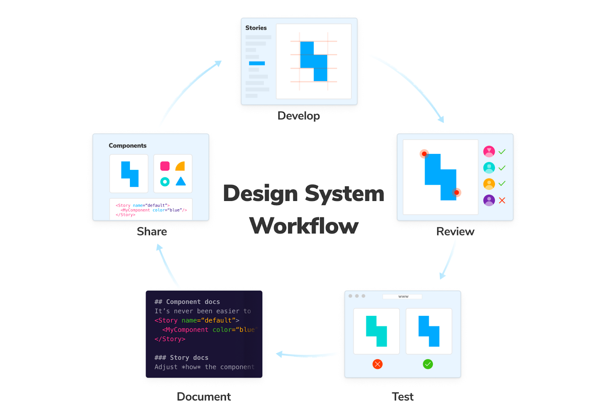

¡Hola a todos! 👋

¿Alguna vez te has encontrado discutiendo con un diseñador porque el botón en el diseño tiene un margen de `17px` y tú has puesto `16px`? ¿O te has pasado la tarde buscando en el código "ese gris que usamos en el footer" para ver si es el mismo que el del header? 🕵️‍♂️

Si has asentido con la cabeza (y has soltado un pequeño suspiro), bienvenido al club. El caos en el desarrollo de interfaces es real. Pero tengo una buena noticia: existe una cura, y se llama **Design System**.

Hoy vamos a dejar de ver los Design Systems como "cosas de diseñadores" y vamos a ver por qué son, posiblemente, la mejor herramienta que puedes tener en tu cinturón de Frontend.

## ¿Qué es (realmente) un Design System? 🤔

Empecemos rompiendo un mito: **Un Design System NO es un UI Kit**. Tampoco es una librería de componentes en Figma, ni un archivo de Sketch perdido en Google Drive.

Un Design System es un **producto**. Es un conjunto de estándares, documentación y principios que acompañan a los componentes para construir interfaces de forma consistente.

> "Un Design System es la única fuente de la verdad que agrupa todos los elementos que permitirán a los equipos diseñar, realizar y desarrollar un producto."

Imagínalo como una caja de **LEGO**.

- Las **piezas** son tus componentes (botones, inputs, cards).
- Las **instrucciones** son la documentación (cuándo usar qué, reglas de espaciado, tono de voz).
- Y lo más importante: **todas las piezas encajan entre sí**.

## Atomic Design: La química de la UI ⚛️

Para entender cómo se estructura un Design System, es casi obligatorio mencionar a **Brad Frost** y su metodología de **Atomic Design**. Es la forma más lógica de pensar en interfaces escalables:

1.  **Átomos**: Los elementos indivisibles. Un label, un input, un botón, un icono. Por sí solos no hacen mucho, pero son la base.
2.  **Moléculas**: Grupos de átomos unidos. Un input + un label + un botón de búsqueda = Una barra de búsqueda.
3.  **Organismos**: Grupos de moléculas. Un header completo (logo + navegación + barra de búsqueda).
4.  **Templates**: La estructura de la página sin contenido real (el esqueleto).
5.  **Páginas**: Las instancias reales con contenido final.

Como Frontends, esto nos suena a música celestial, ¿verdad? Porque es **exactamente** como pensamos en componentes de React, Vue o Angular. 🧩

## ¿Por qué deberías amarlo como Frontend? ❤️

Vale, todo esto suena muy bonito en la teoría, pero ¿qué gano yo en mi día a día?

### 1. Velocidad (Speed) 🚀

Olvídate de reinventar la rueda cada vez que necesitas un modal. Con un Design System, construir una nueva feature es como montar un puzzle. Coges el componente `<Button>`, el `<Card>` y el `<Modal>`, y listo. Te centras en la **lógica de negocio**, no en pelearte con CSS para centrar un div por enésima vez.

### 2. Consistencia (Consistency) 📏

Se acabaron los "50 sombras de gris" en tu CSS. Si el Design System define `color-primary-500`, ese es el color. Punto. La consistencia visual genera confianza en el usuario, y la consistencia en el código genera paz mental en el desarrollador.

### 3. Comunicación (El fin de las guerras Design vs Dev) 🤝

El Design System crea un **lenguaje común**. Cuando el diseñador dice "Botón Primario Small", tú sabes exactamente que es `<Button variant="primary" size="sm" />`. No hay ambigüedad. No hay "pixel pushing" innecesario.

### 4. Mantenibilidad 🛠️

¿Hay que cambiar el radio de los bordes de _todos_ los botones de la app de 4px a 8px?

- **Sin Design System**: Buscar y reemplazar en 50 archivos CSS, rezar para no romper nada. 😱
- **Con Design System**: Cambias una variable en tus Design Tokens o en el componente base, y ¡bum! Magia. ✨

## ¿Cómo empezar? (Sin volverse loco)

No necesitas un equipo de 20 personas dedicado a esto para empezar.

1.  **Auditoría**: Mira lo que tienes. ¿Cuántos botones diferentes hay? ¿Cuántos tamaños de fuente?
2.  **Design Tokens**: Empieza definiendo tus variables básicas: colores, espaciado, tipografía.
3.  **Componentes Base**: Crea los átomos: Botones, Inputs, Iconos.
4.  **Documenta**: Un componente sin documentación es un componente muerto. Usa herramientas como Storybook.

## Conclusión

Un Design System no es una restricción a tu creatividad; es una plataforma para que tu creatividad vuele más alto sin preocuparse por los cimientos. Es la diferencia entre construir castillos de arena (que se los lleva la marea) y construir rascacielos.

Así que la próxima vez que veas a un diseñador organizando su Figma, invítale a un café. Vuestro futuro Design System os lo agradecerá. ☕

¡Nos vemos en el código! 👨‍💻👩‍💻
