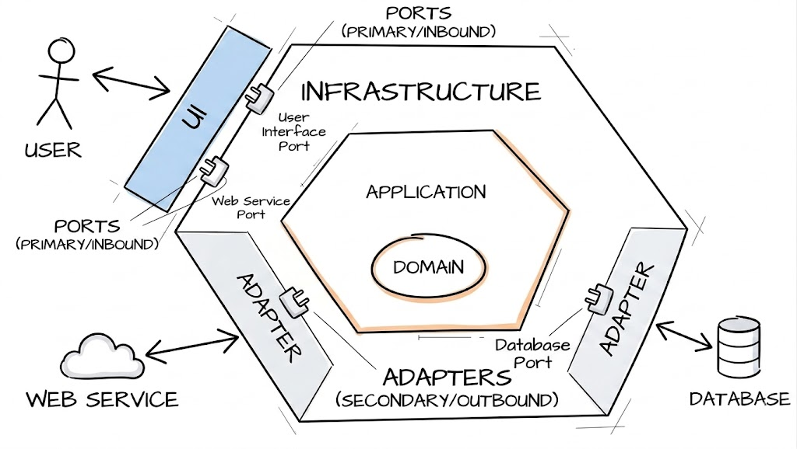
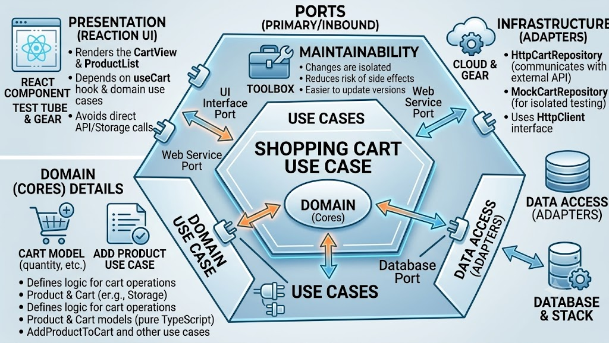

¡Hola a todos! 👋

¿Alguna vez has abierto un proyecto y encontrado React hooks mezclados con llamadas a la API, lógica de negocio dentro de componentes, y state management disperso por todas partes? ¿O peor: has intentado migrar de un framework a otro y terminado reescribiendo toda la app? 😱

Si es así, no estás solo. Las aplicaciones frontend han crecido exponencialmente en complejidad, pero nuestras prácticas arquitectónicas no siempre han seguido el ritmo. Hoy vamos a hablar de un patrón que puede cambiar la manera en que piensas sobre el código frontend: **Hexagonal Architecture**.

## ¿Qué es Hexagonal Architecture? 🤔

Hexagonal Architecture, también conocida como **Ports and Adapters**, fue introducida por **Alistair Cockburn**. La idea central es simple pero poderosa: **separar la lógica central de tu aplicación de las preocupaciones externas**.

Imagina tu aplicación como un hexágono:

- **Dentro** del hexágono: tu **domain** — lógica de negocio, use cases, models.
- **Fuera** del hexágono: **infrastructure** — UI frameworks, HTTP clients, bases de datos, localStorage, etc.

El hexágono se comunica con el mundo exterior a través de **ports** (interfaces) y **adapters** (implementaciones). Esto significa que tu lógica central no le importa si estás usando React, Vue, Angular, o incluso ejecutándose en Node.js.



### ¿Por qué "Hexagonal"?

El hexágono es solo una metáfora visual. Podría ser un pentágono, un octágono, o cualquier forma. Lo importante es que cada **lado** representa una forma diferente en que tu aplicación interactúa con el mundo exterior: interfaz de usuario, llamadas a APIs, almacenamiento, mensajería, etc.

La belleza del hexágono es que tiene suficientes lados para ilustrar múltiples puntos de integración mientras permanece visualmente simple.

## Las Capas Explicadas 🧅

Vamos a desglosar las capas principales:

### 1. Domain Layer (Dentro del Hexágono)

Este es el corazón de tu aplicación. Contiene:

- **Models**: Estructuras de datos puras que representan tus entidades de negocio.
- **Use Cases**: Reglas de negocio específicas de la aplicación. ¿Qué puede _hacer_ el usuario?
- **Repository Interfaces (Ports)**: Contratos que definen _cómo_ acceder a los datos, no _de dónde_ vienen.

```typescript
// domain/models/Product.ts
export interface Product {
  id: string
  name: string
  price: number
  category: string
}

// domain/models/Cart.ts
import { Product } from './Product'

export interface Cart {
  id: string
  items: CartItem[]
}

export interface CartItem {
  product: Product
  quantity: number
}
```

### 2. Ports (Interfaces)

Los ports son los **contratos** entre tu domain y el mundo exterior. Definen lo que tu domain _necesita_, no cómo se implementa.

```typescript
// domain/ports/ProductRepository.ts
import { Product } from '../models/Product'

export interface ProductRepository {
  getAll(): Promise<Product[]>
  getById(id: string): Promise<Product | null>
}

// domain/ports/CartRepository.ts
import { Cart } from '../models/Cart'

export interface CartRepository {
  getCart(userId: string): Promise<Cart>
  addItem(userId: string, productId: string, quantity: number): Promise<Cart>
  removeItem(userId: string, productId: string): Promise<Cart>
}
```

### 3. Use Cases

Los use cases orquestan la lógica de negocio. Dependen únicamente de ports (interfaces), nunca de implementaciones concretas.

```typescript
// domain/usecases/AddProductToCart.ts
import { CartRepository } from '../ports/CartRepository'
import { ProductRepository } from '../ports/ProductRepository'

export class AddProductToCart {
  constructor(
    private cartRepository: CartRepository,
    private productRepository: ProductRepository,
  ) {}

  async execute(userId: string, productId: string, quantity: number) {
    const product = await this.productRepository.getById(productId)
    if (!product) {
      throw new Error('Product not found')
    }

    if (quantity <= 0) {
      throw new Error('Quantity must be greater than zero')
    }

    return this.cartRepository.addItem(userId, productId, quantity)
  }
}
```

### 4. Infrastructure Layer (Fuera del Hexágono)

Aquí es donde viven todas las implementaciones concretas:

- **Adapters**: Implementaciones de tus ports.
- **UI Components**: Código específico del framework (React, Vue, Angular...).
- **HTTP Clients**: Axios, fetch wrappers, GraphQL clients.
- **Storage**: localStorage, IndexedDB, cookies.

```typescript
// infrastructure/repositories/HttpProductRepository.ts
import { ProductRepository } from '../../domain/ports/ProductRepository'
import { Product } from '../../domain/models/Product'
import { HttpClient } from '../http/HttpClient'

interface ProductDTO {
  id: string
  name: string
  price: number
  category: string
}

export class HttpProductRepository implements ProductRepository {
  constructor(private http: HttpClient) {}

  async getAll(): Promise<Product[]> {
    const dtos = await this.http.get<ProductDTO[]>('/api/products')
    return dtos.map(this.toDomain)
  }

  async getById(id: string): Promise<Product | null> {
    const dto = await this.http.get<ProductDTO>(`/api/products/${id}`)
    return dto ? this.toDomain(dto) : null
  }

  private toDomain(dto: ProductDTO): Product {
    return {
      id: dto.id,
      name: dto.name,
      price: dto.price,
      category: dto.category,
    }
  }
}
```

## Dependency Injection: El Pegamento 🧩

Dependency Injection (DI) es la técnica que hace que todo esto funcione. En lugar de que tus use cases creen sus propias dependencias, las **inyectas** desde el exterior.

```typescript
// infrastructure/di/Container.ts
import { HttpProductRepository } from '../repositories/HttpProductRepository'
import { HttpCartRepository } from '../repositories/HttpCartRepository'
import { AxiosHttpClient } from '../http/AxiosHttpClient'
import { AddProductToCart } from '../../domain/usecases/AddProductToCart'

// Crear instancias de infrastructure
const httpClient = new AxiosHttpClient('https://api.example.com')
const productRepository = new HttpProductRepository(httpClient)
const cartRepository = new HttpCartRepository(httpClient)

// Inyectar en los use cases
export const addProductToCart = new AddProductToCart(
  cartRepository,
  productRepository,
)
```

En frameworks como Angular, DI está integrado. En React o Vue, puedes usar librerías como `tsyringe`, `inversify`, o simplemente crear tu propio container.

La belleza de DI es que puedes cambiar implementaciones fácilmente:

```typescript
// Para testing
const mockProductRepository = new MockProductRepository()
const addProductToCart = new AddProductToCart(
  cartRepository,
  mockProductRepository,
)

// Para una API diferente
const fetchHttpClient = new FetchHttpClient('https://other-api.com')
const productRepository = new HttpProductRepository(fetchHttpClient)
```

## ¿Por Qué Esto Importa para el Frontend? 🎯

Puede que estés pensando: "Esto parece cosas de backend. ¿Por qué debería importarme como desarrollador frontend?"

Aquí tienes las razones:

### 1. Independencia del Framework

Tu lógica de negocio no conoce React, Vue, o Angular. Si necesitas migrar de React a Vue (o añadir una app en React Native), tu **domain permanece igual**. Solo cambia la capa de UI.

### 2. Testabilidad

Testing se vuelve trivial. Puedes probar tus use cases con mock repositories sin renderizar ninguna UI:

```typescript
// tests/usecases/AddProductToCart.test.ts
describe('AddProductToCart', () => {
  it('should add a product to the cart', async () => {
    const mockCartRepo: CartRepository = {
      getCart: jest.fn(),
      addItem: jest.fn().mockResolvedValue({ id: '1', items: [] }),
      removeItem: jest.fn(),
    }
    const mockProductRepo: ProductRepository = {
      getAll: jest.fn(),
      getById: jest
        .fn()
        .mockResolvedValue({ id: 'p1', name: 'Test', price: 10 }),
    }

    const useCase = new AddProductToCart(mockCartRepo, mockProductRepo)
    const result = await useCase.execute('user1', 'p1', 1)

    expect(mockCartRepo.addItem).toHaveBeenCalledWith('user1', 'p1', 1)
  })
})
```

### 3. Mantenibilidad

Cuando la API cambia, solo actualizas el adapter. Cuando la lógica de negocio cambia, solo actualizas el use case. Cada cambio está **aislado**.

### 4. Escalabilidad del Equipo

Diferentes miembros del equipo pueden trabajar en diferentes capas sin pisarse unos a otros. El experto de negocio trabaja en use cases, el diseñador trabaja en UI components, y el desarrollador backend trabaja en adapters.

## Un Ejemplo Práctico: Carrito de Compra 🛒

Veamos cómo encajan todas las piezas en un componente real:

```tsx
// presentation/components/ProductList.tsx
import { useEffect, useState } from 'react'
import { Product } from '../../domain/models/Product'
import { GetAllProducts } from '../../domain/usecases/GetAllProducts'
import { AddProductToCart } from '../../domain/usecases/AddProductToCart'

interface ProductListProps {
  getAllProducts: GetAllProducts
  addProductToCart: AddProductToCart
}

export function ProductList({
  getAllProducts,
  addProductToCart,
}: ProductListProps) {
  const [products, setProducts] = useState<Product[]>([])
  const [loading, setLoading] = useState(true)

  useEffect(() => {
    getAllProducts
      .execute()
      .then(setProducts)
      .finally(() => setLoading(false))
  }, [getAllProducts])

  const handleAddToCart = async (productId: string) => {
    try {
      await addProductToCart.execute('current-user', productId, 1)
      alert('¡Producto añadido al carrito!')
    } catch (error) {
      alert(error.message)
    }
  }

  if (loading) return <div>Cargando...</div>

  return (
    <div className="product-list">
      {products.map((product) => (
        <div key={product.id} className="product-card">
          <h3>{product.name}</h3>
          <p>${product.price}</p>
          <button onClick={() => handleAddToCart(product.id)}>
            Añadir al Carrito
          </button>
        </div>
      ))}
    </div>
  )
}
```

Observa cómo el componente **no sabe** de dónde vienen los datos. Podría ser una HTTP API, un mock para testing, o una base de datos local. El componente solo conoce los use cases.



## Estructura del Proyecto 📁

Así es como podrías organizar tus archivos:

```
src/
├── domain/
│   ├── models/
│   │   ├── Product.ts
│   │   └── Cart.ts
│   ├── ports/
│   │   ├── ProductRepository.ts
│   │   └── CartRepository.ts
│   └── usecases/
│       ├── GetAllProducts.ts
│       └── AddProductToCart.ts
├── infrastructure/
│   ├── http/
│   │   ├── HttpClient.ts
│   │   ├── AxiosHttpClient.ts
│   │   └── FetchHttpClient.ts
│   ├── repositories/
│   │   ├── HttpProductRepository.ts
│   │   └── HttpCartRepository.ts
│   └── di/
│       └── Container.ts
└── presentation/
    ├── components/
    │   ├── ProductList.tsx
    │   └── CartView.tsx
    └── hooks/
        └── useCart.ts
```

## Errores Comunes ⚠️

### 1. Over-Engineering

No todos los proyectos pequeños necesitan Hexagonal Architecture completa. Si estás construyendo una landing page simple o una herramienta interna pequeña, el overhead podría no merecer la pena. Usa tu criterio.

### 2. Filtrar Infrastructure en el Domain

Tus domain models deben ser **plain objects**. No uses decoradores o tipos específicos del framework en tus models.

```typescript
// ❌ Mal: Usar tipos específicos de React en el domain
export interface Product {
  id: string
  renderCard: () => JSX.Element // ¡No!
}

// ✅ Bien: Domain model puro
export interface Product {
  id: string
  name: string
  price: number
}
```

### 3. Olvidar los Ports

Algunos desarrolladores se saltan el port (interface) y usan directamente el adapter en los use cases. Esto derrota el propósito. **Siempre define el contrato primero**.

## Cuándo Usar Hexagonal Architecture 🚦

### ✅ Úsala cuando:

- Tu aplicación tiene **lógica de negocio compleja**.
- Necesitas **soportar múltiples plataformas** (web, mobile, desktop).
- Quieres **alta testabilidad**.
- Tu equipo está **creciendo** y necesita límites claros.
- Anticipas **migrar de framework** en el futuro.

### ❌ Considera alternativas cuando:

- Estás construyendo una **app CRUD simple** con lógica mínima.
- El proyecto es un **prototipo o MVP** que necesita salir rápido.
- Tu equipo es pequeño y el overhead no está justificado.

## Conclusión

Hexagonal Architecture no se trata de seguir un conjunto rígido de reglas. Se trata de **pensar** en límites, dependencias y separación de responsabilidades. Se trata de preguntarse: "¿Debería este código conocer React?" (Normalmente, la respuesta es no).

Al separar tu domain de tu infrastructure, creas código que es:

- **Testable**: Mockea el exterior, testea el interior.
- **Migrable**: Cambia de framework sin reescribir la lógica de negocio.
- **Mantenable**: Los cambios están aislados en capas específicas.
- **Escalable**: Diferentes equipos pueden ser dueños de diferentes capas.

La próxima vez que empieces un proyecto frontend, considera dedicar 30 minutos a diseñar tu arquitectura antes de escribir código. Tu yo futuro (y tu equipo) te lo agradecerán.

¡Hasta la próxima, happy coding! 👨‍💻👩‍💻

Peace ✌️
