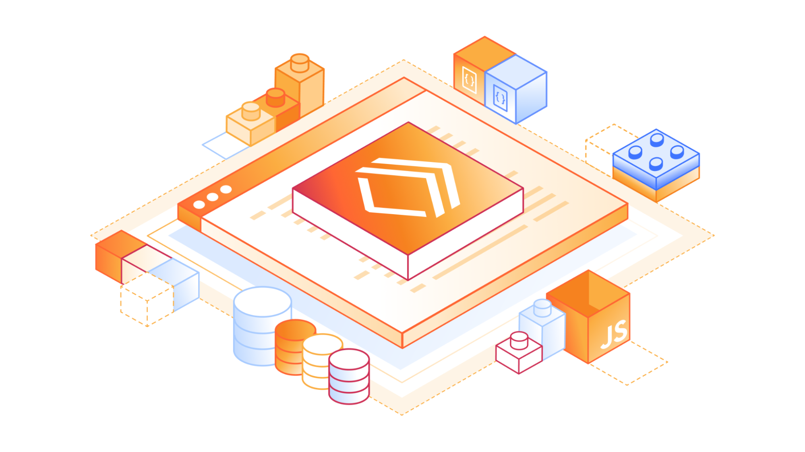

Hace unos años, cuando pensábamos en desplegar una aplicación "Full Stack", la lista de la compra era interminable: un servidor VPS (o una instancia EC2), configurar Nginx, gestionar certificados SSL, configurar una base de datos, preocuparse por el escalado, los backups... La nube prometía facilitarnos la vida, pero a veces parecía que solo añadía más capas de complejidad (y de facturación).

Pero entonces llegó el **Edge Computing**, y con él, **Cloudflare**.

Lo que empezó como una CDN y protección contra DDoS, se ha convertido silenciosamente en una de las plataformas de desarrollo más potentes y versátiles del mercado. Hoy quiero explicarte por qué creo que el stack de Cloudflare (Workers, D1, R2, etc.) es una de las mejores opciones que puedes elegir para tu próximo proyecto en 2025.



### ¿Qué es el "Cloudflare Stack"?

Cuando hablamos de desarrollar en Cloudflare, no nos referimos solo a poner tu web detrás de su proxy. Nos referimos a construir tu aplicación **íntegramente** en su red global.

El corazón de todo esto son los **Cloudflare Workers**. A diferencia de las funciones lambda tradicionales que arrancan contenedores fríos (cold starts), los Workers son aislados V8 que arrancan en milisegundos. Son increíblemente rápidos y se ejecutan en cientos de localizaciones alrededor del mundo, lo más cerca posible de tus usuarios.

Pero una app no es solo cómputo. Aquí es donde entra el resto de la familia:

- **Cloudflare D1**: La pieza que faltaba. Una base de datos SQL (SQLite) nativa en el edge. Por fin podemos tener bases de datos relacionales sin latencias absurdas y con una API sencilla. **Ideal para:** Datos de usuarios, catálogos de productos, CMS.
- **R2**: Almacenamiento de objetos (compatible con S3) pero **sin costes de egreso**. Sí, has leído bien. Puedes servir terabytes de datos sin miedo a la factura. **Ideal para:** Imágenes de usuarios, assets estáticos, backups, PDFs.
- **Durable Objects**: Para cuando necesitas estado y consistencia fuerte. Perfectos para aplicaciones en tiempo real como chats, juegos o herramientas colaborativas (piensa en Figma o Google Docs).
- **KV**: Almacenamiento clave-valor de baja latencia para lecturas masivas. **Ideal para:** Configuración, tokens de sesión, redirecciones.

### ¿Por qué elegir este stack?

Más allá de la tecnología, hay tres razones fundamentales que me han enamorado:

#### 1. Developer Experience (DX) de otro nivel

Si has usado **Wrangler** (la CLI de Cloudflare), sabes de lo que hablo. El desarrollo local es una delicia. Puedes emular todo el entorno de Cloudflare en tu máquina con un solo comando.

Además, frameworks como **Hono** han nacido prácticamente para este entorno. Hono es un framework web ultraligero (menos de 14kb) que funciona nativamente en Workers. Escribir una API REST con Hono y D1 es tan sencillo como esto:

```typescript
import { Hono } from 'hono'
const app = new Hono()

app.get('/posts', async (c) => {
  const { results } = await c.env.DB.prepare('SELECT * FROM posts').all()
  return c.json(results)
})

export default app
```

Sin configuraciones complejas, sin Dockerfiles, sin dolores de cabeza.

Y si hablamos de bases de datos, la combinación de **D1 con Drizzle ORM** es simplemente ganadora. Drizzle es ligero, type-safe y se entiende a las mil maravillas con el ecosistema serverless. Definir tus esquemas en TypeScript y desplegarlos a la red global de Cloudflare es una experiencia que te hace recuperar la fe en el desarrollo backend.

#### 2. Rendimiento Global por defecto

No tienes que configurar regiones. Tu código se despliega automáticamente en toda la red de Cloudflare. Si un usuario accede desde Tokio, tu código corre en Tokio. Si accede desde Madrid, corre en Madrid. La latencia se reduce drásticamente, y la experiencia de usuario mejora instantáneamente.

#### 3. El Pricing (Es ridículamente bueno)

Para proyectos personales, startups e incluso empresas medianas, el tier gratuito de Cloudflare es imbatible.

- **Workers**: 100,000 peticiones al día gratis.
- **R2**: 10 GB de almacenamiento gratis y, repito, **cero costes de egreso**.
- **D1**: 5 millones de lecturas de filas al día gratis.

Puedes escalar a cero (pagar 0€ si nadie usa tu app) y escalar al infinito sin cambiar una sola línea de código.

¿Y si necesitas más? El plan **Workers Paid** es ridículamente barato. Por **$5 al mes** (sí, cinco dólares), obtienes:

- 10 millones de peticiones al mes.
- 30s de tiempo de CPU por petición (vs 10ms en el free).
- Acceso a más recursos y límites más altos.

Es probablemente la nube más barata que existe para escalar un proyecto real.

### Conclusión

El desarrollo web está evolucionando. Ya no necesitamos ser expertos en DevOps para desplegar aplicaciones escalables y resilientes. El stack de Cloudflare nos permite centrarnos en lo que realmente importa: **el código y el producto**.

Si aún no lo has probado, te animo a que instales Wrangler y hagas tu primer "Hello World". Te aseguro que no mirarás atrás.

### ¿Por dónde empiezo?

Si quieres lanzarte a la piscina con todo el stack configurado, te recomiendo encarecidamente este boilerplate: **[Fullstack Next.js + Cloudflare](https://github.com/ifindev/fullstack-next-cloudflare)**.

Es un punto de partida fantástico que ya integra Next.js, Cloudflare Pages, D1 y autenticación. Perfecto para diseccionar cómo funcionan todas las piezas juntas o para lanzar tu MVP en tiempo récord.

¡Nos vemos en el edge! 🚀
